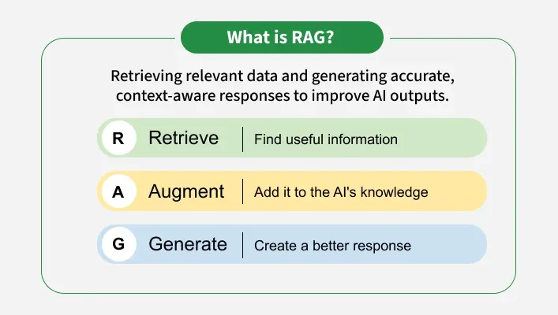
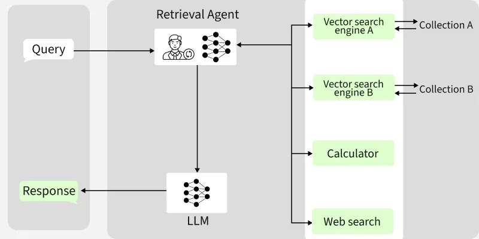
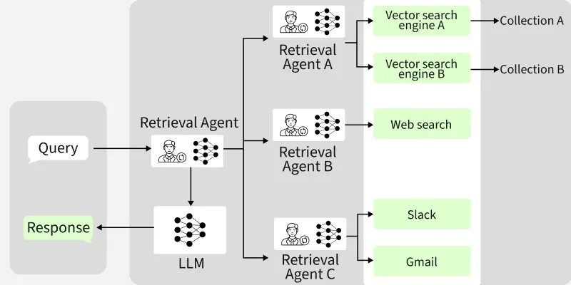
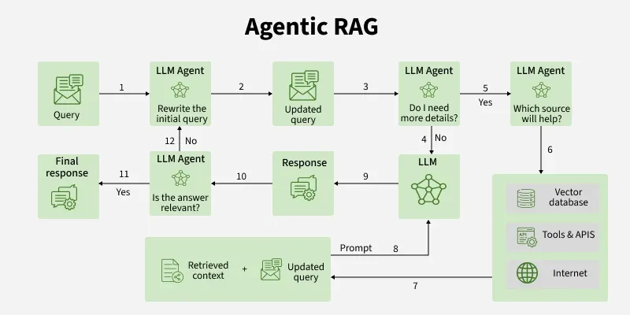

# Agentic Retrieval-augmented generation (Agentic RAG)

## Retrieval-augmented generation (RAG)

### What is RAG

Retrieval-Augmented Generation (RAG) is an advanced AI framework that combines information retrieval with text generation models like GPT to produce more accurate and up-to-date responses. Instead of relying only on pre-trained data like traditional language models, RAG fetches relevant documents from an external knowledge source before generating an answer.

### Overview of Retrieval-Augmented Generation (RAG)

Retrieval-Augmented Generation (RAG) is a technique that enhances the performance of large language models (LLMs) by integrating external information retrieval with text generation. This approach allows LLMs to access updated and domain-specific data, improving the accuracy and relevance of their responses.

### How RAG Works

#### Components of RAG

The main components of RAG are:

    External Knowledge Source: Stores domain specific or general information like documents, APIs or databases

    Text Chunking and Preprocessing: Breaks large text into smaller, manageable chunks and cleans it for consistency

    Embedding Model: Converts text into numerical vectors that capture semantic meaning

    Vector Database: Stores embeddings and enables similarity search for fast information retrieval

    Query Encoder: Transforms the user’s query into a vector for comparison with stored embeddings

    Retriever: Finds and returns the most relevant chunks from the database based on query similarity

    Prompt Augmentation Layer: Combines retrieved chunks with the user’s query to provide context to the LLM

    Retrieval Process: When a user submits a query, RAG retrieves pertinent information from the external source

    LLM (Generator): Generates a grounded response using both the query, retrieved knowledge and the augmented information

    Updater (Optional): Regularly refreshes and re-embeds data to keep the knowledge base up to date

#### Working of RAG

The system first searches external sources for relevant information based on the user’s query instead of relying only on existing training data.

- **Creating External Data:** External data from APIs, databases or documents is chunked, converted into embeddings and stored in a vector database to build a knowledge library.

- **Retrieving Relevant Information:** User queries are converted into vectors and matched against stored embeddings to fetch the most relevant data ensuring accurate responses.

- **Augmenting the LLM Prompt:** Retrieved content is added to the user’s query giving the LLM extra context to work with.

- **Answer Generation:** LLM uses both the query and retrieved data to generate a factually accurate, context aware response.

- **Keeping Data Updated:** External data and embeddings are refreshed regularly in real time or scheduled so the system always retrieves latest information.

#### Steps in the RAG Process

- **Pre-processing:** The external data is cleaned and indexed for efficient retrieval.

- **Query Encoding:** The user's query is transformed into a format suitable for matching against the stored data.

- **Document Retrieval:** Relevant documents are selected based on the encoded query.

- **Response Generation:** The LLM generates a response that incorporates the retrieved information.

#### What Problems does RAG solve?

Some the problems that RAG solves are:

- **Hallucinations:** Traditional generative models can produce incorrect information. RAG reduces this risk by retrieving verified, external data to ground responses in factual knowledge.

- **Outdated Information:** Static models rely on training data that may become outdated. It dynamically retrieves latest information ensuring relevance and accuracy in real time.

- **Contextual Relevance:** Generative models often struggle with maintaining context in complex or multi turn conversations. RAG retrieves relevant documents to enrich the context improving coherence and relevance.

- **Domain Specific Knowledge:** Generic models may lack expertise in specialized fields. It integrates domain specific external knowledge for tailored and precise responses.

- **Cost and Efficiency:** Fine tuning large models for specific tasks is expensive. It eliminates the need for retraining by dynamically retrieving relevant data reducing costs and computational load.

- **Scalability Across Domains:** It is adaptable to diverse industries from healthcare to finance without extensive retraining making it highly scalable.

#### Challenges

Despite its advantages, RAG faces several challenges:

- **Complexity:** Combining retrieval and generation adds complexity to the model requires careful tuning and optimization to ensure both components work seamlessly together.

- **Latency:** The retrieval step can introduce latency making it challenging to deploy RAG models in real time applications.

- **Quality of Retrieval:** The overall performance heavily depends on the quality of the retrieved documents. Poor retrieval can lead to suboptimal generation, undermining the model’s effectiveness.

- **Bias and Fairness:** It can inherit biases present in the training data or retrieved documents, necessitating ongoing efforts to ensure fairness and mitigate biases.

#### RAG Applications

Here are some examples to illustrate the applications of RAG we discussed earlier:

- **Question-Answering Systems:** It enables chatbots or virtual assistants to pull information from a knowledge base or documents and generate accurate, context aware answers.

- **Content Creation and Summarization:** It can gather information from multiple sources and generate concise, simplified summaries or articles.

- **Conversational Agents and Chatbots:** It enhances chatbots by grounding their responses in reliable data making interactions more informative and personalized.

- **Information Retrieval:** Goes beyond traditional search by retrieving documents and generating meaningful summaries of their content.

- **Educational Tools and Resources:** Provides students with explanations, diagrams or multimedia references tailored to their queries.

#### Benefits of RAG

- **Access to Current Information:** RAG allows LLMs to use real-time data, overcoming the limitations of static training datasets.

- **Reduced Hallucinations:** By grounding responses in verified external data, RAG minimizes the risk of generating incorrect information.

- **Cost Efficiency:** Organizations can update their AI models without extensive retraining, saving time and resources.

- **Access to Updated Knowledge:** LLMs are trained on fixed datasets but RAG allows them to fetch fresh and real time information from external sources.

- **Improved Accuracy:** It reduces hallucinations in LLMs and makes answers more factually correct.

- **Domain Specific Expertise:** It lets us use specialized datasets like medical records and legal documents to get expert-level responses without retraining the model.

- **Cost Efficiency:** Instead of retraining massive LLMs with new data, we simply update the external knowledge base hence saving time and resources.

- **Personalization:** RAG can retrieve user specific information like past interactions or personal data to provide more tailored and relevant responses.

RAG is particularly useful in applications like chatbots, content creation, and question-answering systems, where accurate and contextually relevant information is crucial.

## Agentic RAG

Agentic RAG is an advanced version of Retrieval-Augmented Generation (RAG) that uses intelligent AI agents to autonomously retrieve and evaluate information, making decisions on how to best use that data. This approach enhances the ability to handle complex queries and provides more accurate and relevant responses compared to traditional RAG systems.In traditional RAG, the system retrieves information and generates output in one continuous process but Agentic RAG introduces autonomous decision-making.

### Overview of Agentic RAG

Agentic RAG (Retrieval-Augmented Generation) is an advanced AI architecture that enhances traditional RAG by incorporating intelligent AI agents. These agents autonomously retrieve information and make decisions on how to use that data, improving the accuracy and relevance of responses.

#### What Agentic AI and Agents are and how they enhance RAG

- **Agentic AI:** Agentic AI refers to artificial intelligence systems that can perform autonomous decision-making. These agents don’t follow a fixed set of instructions rather they learn from the environment and adapt their actions based on real-time data.

- **Agents:** Agents are autonomous entities that make decisions based on their understanding of the world and the data available to them. These agents can retrieve information, process it and generate actions based on what they have learned. What sets agents apart is their ability to not just react but to actively engage with their environment.

### Key Features of Agentic RAG

#### Dynamic Knowledge Access

- Real-Time Data Retrieval: Unlike traditional RAG, which relies on static training data, agentic RAG can access up-to-date information from various sources, ensuring responses are current and relevant.

#### Autonomous Decision-Making

- Intelligent Agents: These agents can analyze queries, prioritize information, and execute complex workflows. They actively reason about the best approach to retrieve and utilize data.

#### Enhanced Context Handling

- Multi-Step Reasoning: Agentic RAG allows for iterative processes where agents refine queries and validate outputs, leading to more accurate and context-aware responses.

### Architecture of Agentic RAG

Agentic RAG architecture is designed to maximize adaptability and intelligence by leveraging autonomous agents and specialized tool integrations. At its core, the architecture organizes reasoning agents, each capable of decision-making, planning and retrieval, into a coordinated system.

Let's see key components of Agentic RAG Architecture,

1. **Single-Agent RAG (Router)**

    Single-Agent RAG uses a single intelligent agent that routes each user query to the most appropriate data source or tool. It excels in efficiently handling straightforward tasks without added complexity.

    

    - Acts as a central dispatcher for query routing.
    - Suitable for simple, well-defined questions.
    - Chooses between fixed retrieval sources like search engines or databases.

2. **Multi-Agent RAG**

    Multi-agent RAG involves a master agent coordinating multiple specialized sub-agents, each interacting with specific data sources or tools. It enables parallel processing of complex queries by dividing them into sub-tasks.

    

    - Master agent supervises specialized sub-agents.
    - Handles concurrent and parallel queries.
    - Aggregates results for comprehensive, multi-source answers.

3. **Agentic Orchestration**

    Agentic orchestration is the advanced coordination layer that lets agents dynamically plan, validate and iteratively refine workflows. It supports multi-modal data and adaptive strategy adjustment for richer, more accurate responses.

    - Enables dynamic multi-step planning and feedback loops
    - Supports memory and intermediate result validation
    - Handles diverse data types like text, images and real-time inputs

### Working of Agentic RAG

Here's a breakdown of how it functions:

- **Query Input:** The user submits a query, initiating the process.
- **Query Refinement:** An LLM agent reviews and rewrites the query for clarity, if needed, ensuring optimal data retrieval.
- **Information Sufficiency:** The agent checks if further details are needed. If so, more information is gathered before proceeding.
- **Source Selection:** The agent determines the best source for the query—vector database, APIs/tools or internet based on context.
- **Data Retrieval:** The chosen source is queried and relevant context is collected.
- **Context Integration:** Retrieved context is combined with the updated query to enrich understanding.
- **Response Generation:** The LLM produces a response using the enhanced context and query.
- **Answer Validation:** The agent verifies whether the response is relevant to the original question.
- **Final Output:** If validated, the system delivers a precise, context-aware final response.

### Types of Agents in Agentic RAG Based on Function

Here are different types of Agentic RAG agents based on their functional roles:

- **Routing Agent:** Uses a large language model (LLM) to analyze queries and route them to the most suitable RAG pipeline. It performs basic agentic reasoning to select the right task pipeline such as document summarization or question answering.

- **One-Shot Query Planning Agent:** Breaks down complex queries into independent subqueries that run in parallel across various RAG pipelines. The results from these subqueries are then combined into a comprehensive answer. For example, it handles multi-faceted questions about weather in different cities by dividing and processing each part simultaneously.

- **Tool Use Agent:** Enhances standard RAG by integrating external tools like APIs or databases to fetch live or specialized data before generating responses. The agent decides when and how to use such tools, for example, retrieving real-time stock prices from a financial API.

- **ReAct Agent (Reason + Act):** Combines reasoning with actions to tackle complex, multi-step queries iteratively. It decides which tools to use, gathers inputs and adjusts its approach based on ongoing results. For example, it might track an order by querying a database for status, then a shipping API and finally synthesizing the information.

- **Dynamic Planning and Execution Agent:** Handles the most complex workflows by creating detailed step-by-step plans, often using computational graphs. It sequences tasks methodically, managing each step with specific tools or data sources.

### Comparison: Traditional RAG vs. Agentic RAG

| Feature            | Traditional RAG                                                | Agentic RAG                                                              |
|--------------------|----------------------------------------------------------------|--------------------------------------------------------------------------|
| Retrieval Strategy | Static - Uses fixed, predefined sources like documents and dbs | Dynamic and adaptive                                                     |
| Workflow           | Linear                                                         | Iterative and multi-step                                                 |
| Context Handling   | Fixed chunks                                                   | Semantic segmentation and refinement                                     |
| Decision-Making    | Reactive - follows predefined workflows                        | Autonomous and proactive                                                 |
| Flexibility        | Low flexibility; static retrieval and generation methods.      | High - adapts retrieval and processing strategies                        |
| Adaptability       | Limited adaptability; struggles with new or dynamic inputs.    | Highly adaptable; continuously refines and improves performance.         |
| Autonomy           | Dependent on explicit user queries; no self-initiated action.  | Operates independently, learns and adapts in real-time.                  |
| Use Case           | Suitable for FAQs, simple Q&A and static search.               | Ideal for dynamic chatbots, recommendation systems and complex workflows |

### Applications of Agentic RAG

Agentic RAG is particularly useful in complex environments where accurate, context-aware information is critical. It can be applied in various fields, including customer support, research, and data analysis, where it enhances the ability to manage large datasets and complex queries effectively.

This innovative approach marks a significant evolution in AI-driven information retrieval, making it a vital tool for organizations facing increasing data complexity.

### Agent Frameworks for Agentic RAG

Agent frameworks provide structured environments for building and deploying AI agents in Agentic RAG systems. Using these frameworks helps in the development and enhances system capabilities. Lets see Key Agent Frameworks:

1. LangChain

    [***LangChain***](<https://docs.langchain.com/oss/python/langchain/overview>) is designed to simplify the integration of AI agents into Agentic RAG systems which offers a framework for building applications with language models. It provides a variety of tools that enable efficient management of prompts, chaining of language model calls and good interaction with various data sources and APIs.

    By offering various components for agent development it enhances flexibility and scalability of Agentic RAG implementations helps in allowing developers to build dynamic and adaptive systems that can scale easily while managing complex tasks and workflows.

2. LlamaIndex

    [**LlamaIndex**](<https://developers.llamaindex.ai/python/framework/understanding/agent/>) is formerly known as GPT Index which helps in the integration of large language models with external data sources which creates efficient interfaces for retrieval-augmented generation tasks. It supports construction of indices over data helps in enabling agents to perform efficient and context-aware information retrieval.

    By optimizing the data retrieval process, it improves the responsiveness and accuracy of agents within Agentic RAG systems which ensures that the system can retrieve the most relevant data and generate more accurate responses for complex tasks.

3. LangGraph

    [**LangGraph**](<https://docs.langchain.com/oss/python/langgraph/overview>) is an orchestration framework designed for developing Agentic RAG systems helps in the creation of complex workflows that involve multiple agents. It provides tools for defining agent interactions helps in managing state and handling asynchronous operations which ensures good coordination between different agents.

    By offering a clear and structured approach to workflow management, it simplifies development of advanced agent-based systems. Using the framework like LangGraph into Agentic RAG systems can increase their performance, adaptability and scalability which leads to the development of more intelligent, responsive and efficient AI solutions.

4. CrewAI

    [**CrewAI**](<https://docs.crewai.com/en/concepts/agents>): Sometimes one agent isn’t enough. CrewAI lets you build a team, like a Researcher, a Writer, and an Editor, who work together to solve a task.

### Advantages of Agentic RAG

- **Autonomous Decision-Making:** Intelligent agents process data and make decisions independently helps in improving efficiency and context awareness.
- **Scalability:** Modular design allows multiple agents to handle tasks in parallel which helps in efficiently managing large data volumes.
- **Context-Aware Responses:** Advanced retrieval and decision-making ensure responses are personalized and relevant.
- **Flexibility and Adaptability:** Agents adapt to changing environments helps in making Agentic RAG suitable for various applications like chatbots and recommendation systems.

### Challenges of Agentic RAG

Despite having many advantages, Agentic RAG systems also face some challenges:

- **Complexity:** Managing multiple agents, data sources and decision-making processes is complex.
- **Data Quality:** Poor data quality can lead to inaccurate responses and reduced system effectiveness.
- **High Latency:** Handling multiple requests may cause delays due to the involvement of several agents.
- **Resource Intensive:** Need for multiple agents and models makes the system computationally and resource-heavy.

## ***Building an Agentic RAG Pipeline***

Follow link to [**Building an Agentic RAG Pipeline**](agentic_rag_pipeline.md)
